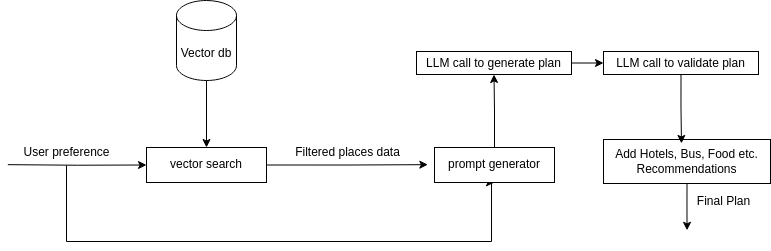

## Smart Yatra
Smart Yatra is a modern trip planning platform that allows you to effortlessly plan your next adventure with just a few clicks. Forget spending weeks organizing a trip—Smart Yatra creates detailed travel plans within seconds based on your preferences, budget, and duration. Not satisfied with the generated plan? No problem! You can request changes and get updated recommendations instantly.

The platform also helps you explore nearby hotels, events, and transportation options, allowing you to book them directly, making trip planning seamless and hassle-free.

---

## Key Features
- **AI-Powered Trip Planning**: Generate personalized travel itineraries based on your inputs like budget, duration, and preferences.
- **Dynamic Modifications**: Easily tweak generated plans to better suit your needs.
- **Integrated Booking**: Book hotels, transportation, and activities directly through the platform.
- **Explore Nepal**: Discover tourist destinations, events, and hidden gems in Nepal.

---

## File/Folder Structure

### Backend
The backend powers the platform’s data processing, AI integrations, and database operations.

```
backend/
├── data/               # Contains data in CSV format, e.g., places, activities, hotels, etc.
├── images/             # Directory for images used in the backend.
├── app.py              # Main FastAPI script for backend endpoints.
├── data.py             # Handles interactions with ChromaDB for data storage and querying.
├── plans.py            # Integrates with LLM for generating and editing trip plans.
├── plan_details.py     # Adds hotels, food, transportation, and other details to plans.
├── prompts.py          # Generates dynamic prompts based on input data.
├── requirements.txt    # Lists all required Python libraries.
├── test.ipynb          # Jupyter Notebook for testing backend functionality (ignored in Git).
├── chromadb/           # Persistent directory for ChromaDB (ignored in Git).
└── .env                # Stores environment variables like API keys (ignored in Git).
```

### Frontend
The frontend is built using React and Vite, delivering a smooth and intuitive user experience.

```
frontend/
├── node_modules/        # Dependency files (generated by npm/yarn).
├── package.json         # Project configuration and dependencies.
├── package-lock.json    # Dependency lock file.
├── src/                 # Main source code.
│   ├── assets/          # Images and SVGs used in the frontend.
│   ├── components/      # Reusable React components and their styles.
│   ├── pages/           # Different pages of the application.
│   │   ├── Home/        # Homepage of the website.
│   │   ├── Form/        # Input preferences for trip planning.
│   │   ├── Packages/    # Displays generated travel packages.
│   │   └── Explore/     # Details about places in Nepal.
└── vite.config.js       # Configuration for the Vite bundler.
```

---

# Backend flowchart


## How to Run the Project

### Prerequisites
- Python 3.8+
- Node.js 16+
- npm or yarn
- Docker (optional, for database persistence)

### Backend Setup
1. Clone the repository:
   ```bash
   git clone https://github.com/your-repo/smart-yatra.git
   cd smart-yatra/backend
   ```
2. Create a virtual environment:
   ```bash
   python -m venv venv
   source venv/bin/activate   # On Windows: venv\Scripts\activate
   ```
3. Install the dependencies:
   ```bash
   pip install -r requirements.txt
   ```
4. Set up environment variables:
   - Create a `.env` file in the `backend/` directory.
   - Add necessary keys (e.g., API keys for AI services).

5. Run the backend server:
   ```bash
   uvicorn app:app --reload
   ```
   The backend will be available at `http://localhost:8000`.

### Frontend Setup
1. Navigate to the frontend directory:
   ```bash
   cd ../frontend
   ```
2. Install dependencies:
   ```bash
   npm install
   ```
3. Start the development server:
   ```bash
   npm run dev
   ```
   The frontend will be available at `http://localhost:5173`.

---

## Additional Notes
- **Database**: Ensure ChromaDB is set up before running the backend. The database directory (`chromadb/`) is ignored in Git.
- **Testing**: Use `test.ipynb` for debugging backend components. This file is also ignored in Git.
